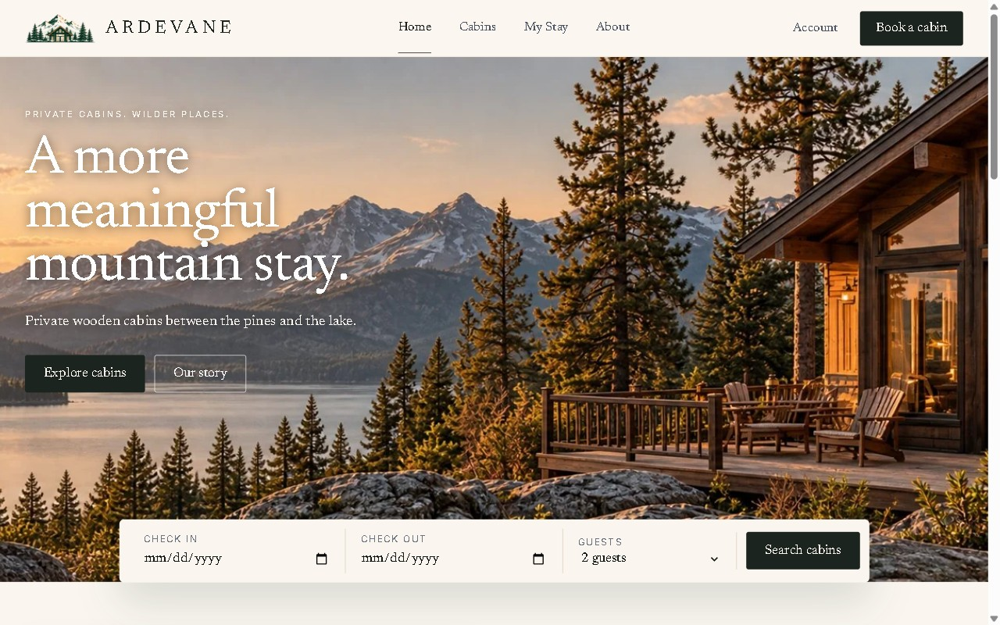
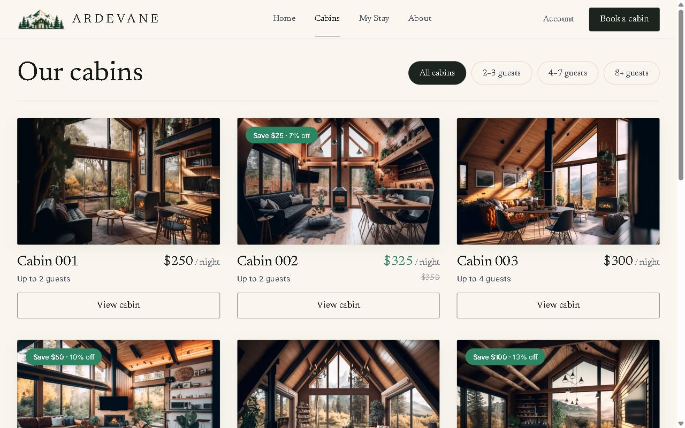
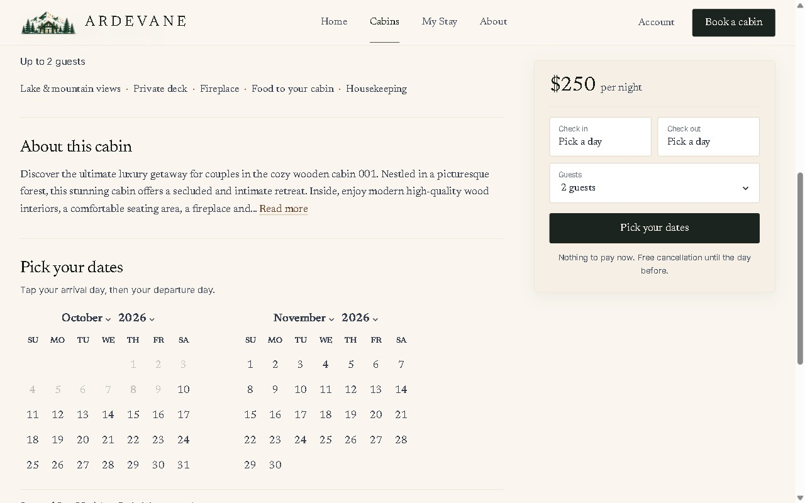
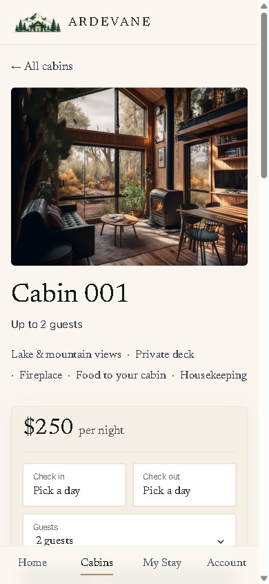

# Ardevane Guest Website

The guest-facing side of Ardevane, a cabin hospitality system made of two applications on one Supabase backend. Guests use this site to browse the cabins, ask for a reservation, manage their upcoming stays and, once they arrive, order food and ask for things from their cabin. The staff side is [Ardevane Operations](https://github.com/ahmedmoh14314-code/ardevane-operations); both apps read and write the same database.

Live at [ardevane.netlify.app](https://ardevane.netlify.app).

## Overview

The guest journey, in the order the site presents it:

1. **Browse cabins**, filtered by how many guests they sleep, each with a gallery, price and discount.
2. **Pick dates and guests** on the cabin page. The calendar greys out nights that are already taken and enforces the minimum and maximum stay from the hotel's settings. Dates and guests chosen on the home page search carry over.
3. **Review the reservation**: cabin, nights, guests and the price, which the database works out.
4. **Sign in to confirm**, with Google or email and password. Every sign-in route returns to the same review page with the stay intact.
5. **Reservation request**. A booking made on the website starts as `pending` and holds its nights until the hotel approves it in Operations.
6. **Account**: the next stay, the full list of reservations (upcoming, past, cancelled), and the profile.
7. **My Stay**, from a confirmed reservation onwards: the cabin, "Day 2 of 6", the food menu, housekeeping, cabin and maintenance requests, a message to the team, and the running charges.
8. **Past stays**, each with its final charges and the requests made during it.

## Key Features

- Cabin listing with a capacity filter, and a cabin page with a gallery and description.
- Availability-aware date picker: taken nights, stay-length rules, and a range that starts over when it would cross a taken night.
- Reservation review with a price quoted by the database.
- Authentication with Google or email and password (Supabase Auth). A guest profile is created on first sign-in, or linked to the guest record the hotel already had for that email.
- Guest account: upcoming, past and cancelled reservations; edit guests and notes, or cancel, until the day before arrival; profile with nationality and ID for a quicker check-in.
- My Stay: a dining menu in sections (breakfast, lunch, dinner, desserts, drinks) with dish photos, ordered for a day and time of the stay; housekeeping, cabin and maintenance requests; messages to the team; and the status of each request as staff move it on.
- Charges view: accommodation, extra charges and payments recorded at the desk, read-only for the guest.
- Responsive layout for phones and desktop, with a bottom tab bar on phones.

## How Ardevane Works

The two applications never talk to each other directly. They share one database, so an action on one side shows up on the other:

- Guest sends a reservation request → it appears in the Operations booking requests, where staff approve or decline it.
- Staff check the guest in → the guest's account switches to My Stay.
- Guest orders food or asks for housekeeping → the request lands in the Operations request queue.
- Staff mark a food order delivered → one charge is added to the stay's folio, and the guest sees it under their charges.
- Staff archive a cabin or change the stay rules in Settings → the website reflects it on the next render.

## Architecture

```
   Next.js Guest Website            React Operations Dashboard
   (this repository)                (ardevane-operations)
             \                            /
              \                          /
                      Supabase
            Postgres · Auth · Storage
```

The database is the shared source of truth. Tables, row-level security policies, booking functions and triggers are defined by the migrations in the Operations repository. This site only reads tables and calls those functions.

Server Components fetch data on the server with the visitor's own session (`@supabase/ssr`), and Server Actions call the database functions for writes. A middleware refreshes the session cookie and sends signed-out visitors from `/account` and `/my-stay` to the sign-in page.

## Engineering Decisions

- **Booking rules live in the database.** The browser sends a cabin, two dates and a guest count. `create_booking` re-checks that the cabin is open, the stay length and capacity are allowed and the nights are free, and sets the price itself. An exclusion constraint makes overlapping stays in one cabin impossible even for two simultaneous requests.
- **One Supabase Auth for guests and staff, with different rights.** Signing in gives no staff permissions; staff are the rows in `staff_members`. Row-level security limits a guest to their own profile, bookings, charges and requests.
- **No secret key on the website.** The app only ever acts as the anonymous visitor or the signed-in guest, so the database policies decide what each one can see or change.
- **Authentication comes last.** Browsing, picking dates and seeing the price need no account. Sign-in is asked for at the confirmation step, and the chosen stay survives the round trip.
- **The account follows the stay.** The same pages show a booking prompt, the next reservation, or My Stay depending on the state of the guest's bookings (`pending`, `reserved`, `checked_in`, `checked_out`, `cancelled`, `no_show`).
- **Cancelling keeps the record.** A cancelled booking stays in the database with a `cancelled` status and frees its nights. Every booking has a short reference such as `ARD-7K3Q9P`.
- Cabin pages are generated at build time and revalidated every hour.

## Tech Stack

- Next.js 14 (App Router, Server Components, Server Actions)
- React 18
- Supabase: PostgreSQL, Auth, Storage, with `@supabase/ssr` for the server session
- Tailwind CSS
- date-fns and react-day-picker
- Vitest (41 unit tests for the date, pricing, account and request helpers)

## Screenshots

Taken from the live site.

| Home | Cabins |
| --- | --- |
|  |  |

| Cabin page with the calendar | On a phone |
| --- | --- |
|  |  |

## Local Development

```bash
npm install
cp .env.example .env.local   # fill in the Supabase URL and publishable key
npm run dev                  # http://localhost:3000
npm test                     # unit tests
```

The database comes from the [Operations repository](https://github.com/ahmedmoh14314-code/ardevane-operations): apply its `supabase/migrations` to your project first.

In the Supabase dashboard:

- **Authentication → URL Configuration → Redirect URLs**: add `http://localhost:3000/**` (and your deployed address).
- **Authentication → Providers → Google**: enable it with a Google OAuth client whose redirect URI is the callback URL Supabase shows there.

## Related Repository

[Ardevane Operations](https://github.com/ahmedmoh14314-code/ardevane-operations), the staff dashboard that owns the database and handles bookings, check-in and checkout, cabins, requests and folios.
